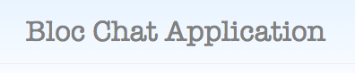
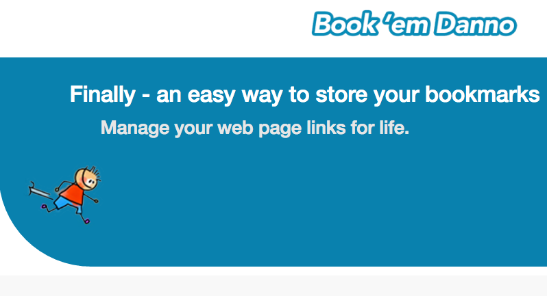
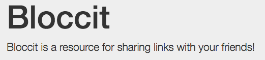
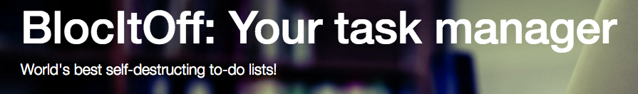
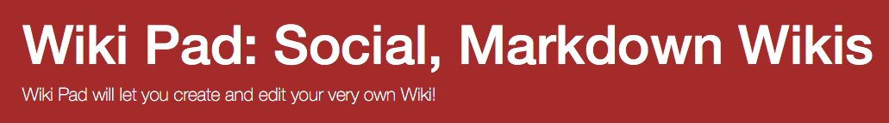
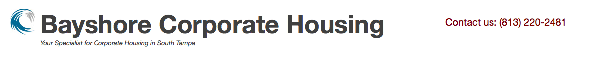
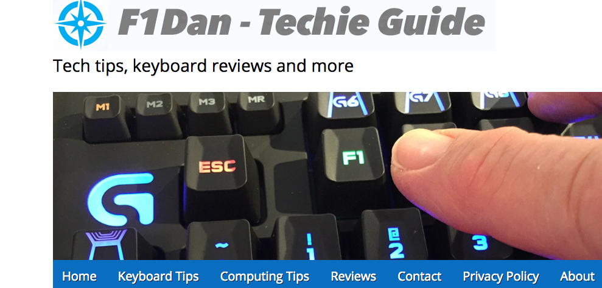
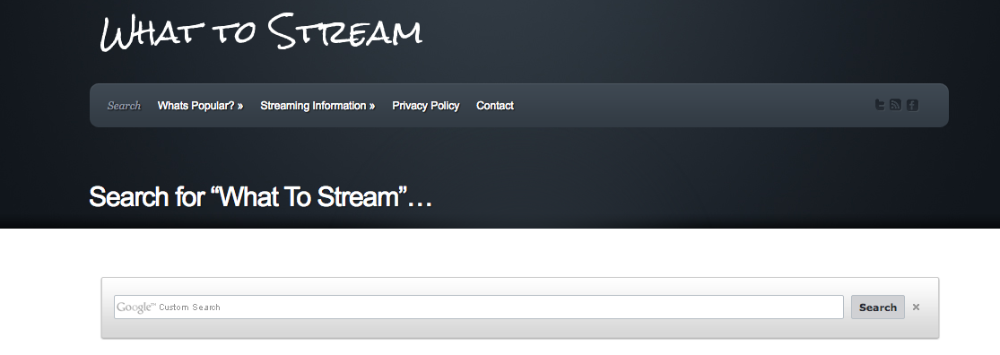
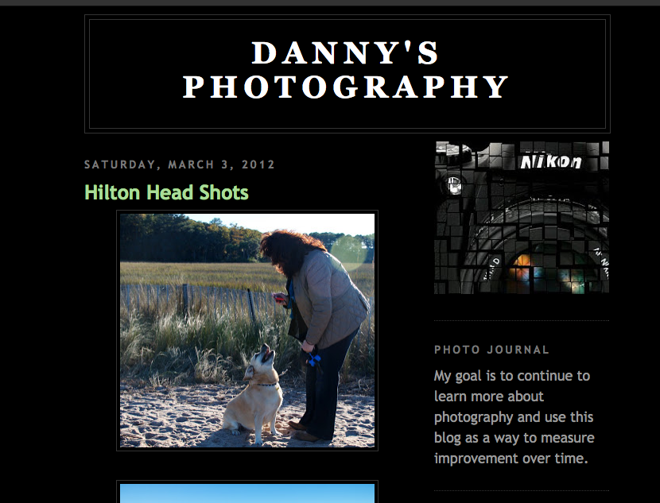

<link rel="stylesheet" href="css/animate.css">

Here you can find information on projects that I have or are currently working on. I develop using Ruby on Rails, Javascript, HTML, CSS, jQuery, AngularJS, Wordpress, and various other technologies as needed. The majority of my work is stored in [Gitbub](https://github.com/builditdan) where I use the id **builditdan**.

 

   

  <strong>Project Name:</strong> Bloc Chat Application   
  <strong>Description:</strong>  A Javascript site I built during my [bloc.io](http://bloc.io) training where users can create conversations and chat with other members. 
  <strong>Info:</strong> <a href="/projects/blocchat.html">/projects/blocchat.html</a> 
   

   
  <strong>Project Name:</strong> Bloc Jams   
  <strong>Description:</strong>  A demo of a music site I built during my foundation training at bloc using Javascript. 
  <strong>Info:</strong> <a href="/projects/blocjams.html">/projects/blocjams.html</a> 
   

   
  <strong>Project Name:</strong> Bloc Jams - AngularJS   
  <strong>Description:</strong>  A demo of a music site that I refactored during my bloc training to use Angular. 
  <strong>Info:</strong> <a href="/projects/blocjamsangular.html">/projects/blocjamsangular.html</a> 
   

   
  <strong>Project Name:</strong> Another Pomodoro Timer   
  <strong>Description:</strong> A AngularJS site I built during my bloc training that times tasks using the Pomodoro Technique. 
  <strong>Info:</strong> <a href="/projects/apomodoro.html">/projects/apomodoro.html</a> 
   

   
  <strong>Project Name:</strong> BookemDanno   
  <strong>Description:</strong> A Ruby on Rails site I built during my bloc training for easily storing and sharing bookmarks 
  <strong>Info:</strong> <a href="/projects/bookemdanno.html">/projects/bookemdanno.html</a> 
   

   
  <strong>Project Name:</strong> Bloccit   
  <strong>Description:</strong> A Ruby on Rails Reddit clone that I built during my foundation training at bloc 
  <strong>Info:</strong> <a href="/projects/bloccit.html">/projects/bloccit.html</a> 
   

   
  <strong>Project Name:</strong> BlocItOff   
  <strong>Description:</strong> A Ruby on Rails task management application that I built during my training at bloc 
  <strong>Info:</strong> <a href="/projects/blocitoff.html">/projects/blocitoff.html</a> 
   

   
  <strong>Project Name:</strong> Wiki Pad   
  <strong>Description:</strong> A RoR site I built during my bloc training for creating and sharing wikis 
  <strong>Info:</strong> <a href="/projects/wikipad.html">/projects/wikipad.html</a>
   

   
  <strong>Project Name:</strong> Bayshore Corporate Housing   
  <strong>Description:</strong> A Wordpress site I built for corporate housing in Tampa. 
  <strong>Info:</strong> <a href="http://www.bayshorecorporatehousing.com">http://www.bayshorecorporatehousing.com</a> 
   

   
  <strong>Project Name:</strong> Mr. South Tampa 
  <strong>Description:</strong> A Wordpress site I built for a real estate business professional in Tampa. 
  <strong>Info:</strong> <a href="http://mrsouthtampa.com">http://mrsouthtampa.com</a>  
   

   
  <strong>Project Name:</strong> F1Dan   
  <strong>Description:</strong> A Wordpress site where I have posted about keyboards and other stuff. 
  <strong>Info:</strong> <a href="http://www.f1dan.com/">http://www.f1dan.com/</a>  
   

   
  <strong>Project Name:</strong> What to Stream   
  <strong>Description:</strong> A Wordpress site with a litte custom PHP for searching for movies (I plan to rebuild this site using Javascript and AngularJS. 
  <strong>Info:</strong> <a href="http://www.whattostream.com/">http://www.whattostream.com/</a>  
   

   
  <strong>Project Name:</strong> Danny's Photography   
  <strong>Description:</strong> A hosted blogging site that I occasionally update with photos. 
  <strong>Info:</strong> <a href="http://daniels111.blogspot.com/">http://daniels111.blogspot.com/</a>  
   

