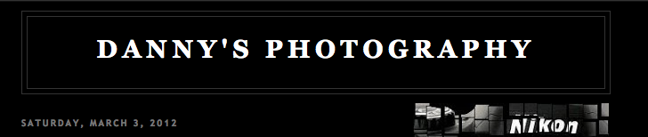

<h4 style="color:red;">
Under construction
</h4>
On my portoflio page you can find information on projects that I have or are currently working on. I develop using Ruby on Rails, Javascript, HTML, CSS, jQuery, AngularJS, Wordpress, and various other technologies as needed. The majority of my work is stored in [Gitbub](https://github.com/builditdan) where I use the id **builditdan**.

 

 
**Project Name:** BookemDanno  
**Description:** A RoR site I built during my [bloc.io](http://bloc.io) training for easily storing and sharing bookmarks 
**Info:** <a href="/projects/bookemdanno.html">/projects/bookemdanno.html</a> 

 

 
**Project Name:** Wiki Pad  
**Description:** A RoR site I built during my [bloc.io](http://bloc.io) training for creating and sharing wikis 
**Info:** <a href="/projects/wikipad.html">/projects/wikipad.html</a>

 

 
**Project Name:** Bayshore Corporate Housing  
**Description:** A Wordpress site I built for corporate housing in the Tampa area 
**Info:** <a href="http://www.bayshorecorporatehousing.com">http://www.bayshorecorporatehousing.com</a> 

 

 
**Project Name:** Mr. South Tampa  
**Description:** A Wordpress site I built for my brother real estate business (not live yet) 
**Info:** <a href="http://rareresearchsolutions.com/mrsouthtampa/">http://rareresearchsolutions.com/mrsouthtampa/</a> 

 

 
**Project Name:** F1Dan  
**Description:** A Wordpress site where I have posted about keyboards and other stuff 
**Info:** <a href="http://www.f1dan.com/">http://www.f1dan.com/</a> 

 

 
**Project Name:** What to Stream  
**Description:**A Wordpress site with a litte custom PHP for searching for movies (I plan to rebuild this site next month using Javascript and AngularJS) 
**Info:** <a href="http://www.whattostream.com/">http://www.whattostream.com/</a> 

 

 
**Project Name:** Danny's Photography   
**Description:** A hosted blogging site that I occasionally update with photos 
**Info:** <a href="http://daniels111.blogspot.com/">http://daniels111.blogspot.com/</a> 

 
