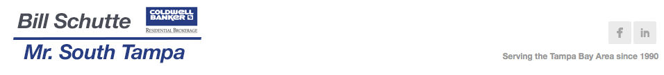

<link rel="stylesheet" href="css/animate.css">

Here you can find information on projects that I have or are currently working on. I develop using Ruby on Rails, Javascript, HTML, CSS, jQuery, AngularJS, Wordpress, and various other technologies as needed. The majority of my work is stored in [Gitbub](https://github.com/builditdan) where I use the id **builditdan**.

 

   
  <strong>Project Name:</strong> NextMoveIQ   
  <strong>Description:</strong> A Ruby on Rails site I built to help realtors and consumers find their ideal neighborhood. 
  <strong>Info:</strong> <a href="http://nextmoveiq.com">http://nextmoveiq.com</a>  
   

 

   
  <strong>Project Name:</strong> Bayshore Corporate Housing   
  <strong>Description:</strong> A Wordpress site I built for corporate housing in Tampa. 
  <strong>Info:</strong> <a href="http://www.bayshorecorporatehousing.com">http://www.bayshorecorporatehousing.com</a> 
   

   
  <strong>Project Name:</strong> Mr. South Tampa 
  <strong>Description:</strong> A Wordpress site I built for a real estate business professional in Tampa. 
  <strong>Info:</strong> <a href="http://mrsouthtampa.com">http://mrsouthtampa.com</a>  
   

   
  <strong>Project Name:</strong> What to Stream   
  <strong>Description:</strong> A Wordpress site with a little custom PHP for searching for movies (I plan to rebuild this site using Javascript and AngularJS. 
  <strong>Info:</strong> <a href="http://www.whattostream.com/">http://www.whattostream.com/</a>  
   

